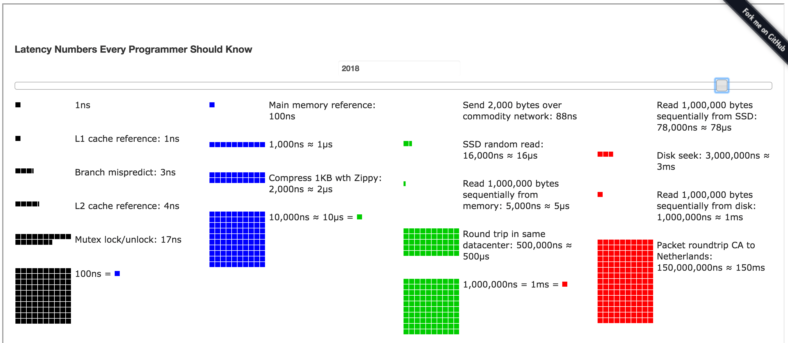

# Latency Numbers Every Programmer Should Know

```txt
Latency Comparison Numbers
--------------------------
L1 cache reference                                0.5 ns
Branch mispredict                                 5   ns
L2 cache reference                                7   ns                      14x L1 cache
Mutex lock/unlock                               100   ns
Main memory reference                           100   ns                      20x L2 cache, 200x L1 cache
Compress 1K bytes with Zippy                 10,000   ns       10 us
Send 1 KB bytes over 1 Gbps network          10,000   ns       10 us
Read 4 KB randomly from SSD*                150,000   ns      150 us          ~1GB/sec SSD
Read 1 MB sequentially from memory          250,000   ns      250 us
Round trip within same datacenter           500,000   ns      500 us
Read 1 MB sequentially from SSD*          1,000,000   ns    1,000 us    1 ms  ~1GB/sec SSD, 4X memory
Disk seek                                10,000,000   ns   10,000 us   10 ms  20x datacenter roundtrip
Read 1 MB sequentially from 1 Gbps       10,000,000   ns   10,000 us   10 ms  40x memory, 10X SSD
Read 1 MB sequentially from disk         30,000,000   ns   30,000 us   30 ms 120x memory, 30X SSD
Send packet CA->Netherlands->CA         150,000,000   ns  150,000 us  150 ms

Notes
-----
1 ns = 10^-9 seconds
1 us = 10^-6 seconds = 1,000 ns
1 ms = 10^-3 seconds = 1,000 us = 1,000,000 ns
```


 操作 | 延迟(纳秒) | 延迟(微秒) | 延迟(毫秒) | 参考
 --- | ---: | ---: | ---: | ---
CPU L1 级缓存访问 | 0.5 ns | | |
分支预测错误* | 5 ns | | |
CPU L2 级缓存访问 | 7 ns | | | 14x L1 cache
互斥体 Mutex 加锁/解锁 | 25 ns | | |
内存访问 | 100 ns | | | 20x L2 cache, 200x L1 cache
用 Zippy 压缩1K字节 | 3,000 ns | 3 us | |
在 1 Gbps 速率的网络上发送 1K 字节 | 10,000 ns | 10 us | |
从 SSD 读取 4K 长度的随机数据 | 150,000 ns | 150 us | | ~1GB/sec SSD
从内存读取连续的 1 MB 长度数据 | 250,000 ns | 250 us | |
在同一数据中心内的来回通讯延迟* | 500,000 ns | 500 us | |
从 SSD 读取连续的 1 MB 长度数据 | 1,000,000 ns | 1,000 us | 1 ms | ~1GB/sec SSD, 4X memory
磁盘寻址 | 10,000,000 ns | 10,000 us | 10 ms | 20x datacenter roundtrip
从磁盘读取连续的 1 MB 长度数据 | 20,000,000 ns | 20,000 us | 20 ms | 80x memory, 20X SSD
发送数据包 CA->Netherlands->CA | 150,000,000 ns | 150,000 us | 150 ms |


